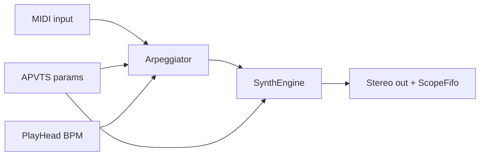

# Junova-X DSP architecture

## Pipeline



| Stage | Class | Thread | Allocations |
|-------|--------|--------|-------------|
| MIDI arp | `Source/DSP/Arpeggiator.*` | audio | none in `process` |
| Voices + VCF | `Source/DSP/SynthEngine.*` | audio | none in `render` |
| Chorus | `Source/DSP/BbdChorus.*` | audio | none |
| Test tone | `Source/DSP/DiagTone.*` | audio | none |
| Scope | `Source/DSP/ScopeFifo.h` | audio → UI timer | lock-free FIFO |

## Arpeggiator (WO-2026-004)

- **Bypass:** `arpRate ≤ 0.01` passes MIDI unchanged.
- **Held notes:** up to 16; sorted upward pattern.
- **Range:** `arpRange` 1–4 octaves (UI fader 1–4).
- **Rate:** normalized fader maps to step length vs **host BPM** (fallback 120).
- **PPQ:** steps on 1/16, 1/8, 1/4, 1/2 quarter-note grid from host `ppqPosition` (free-run PPQ in standalone).
- **Latch:** `arpLatch` keeps held notes after key release until all-notes-off.
- **Future:** swing, down/random patterns, sample-accurate sub-block placement refinements.

## SynthEngine

- **8 voices** — poly / mono (glide) / unison (detune spread).
- **DCO** — saw + PWM mix, sub sine, noise.
- **VCF** — `StateVariableTPTFilter` per voice; cutoff from base + filter ADSR + LFO + key track.
- **Master** — width, HPF (optional), `BbdChorus`, smoothed gain.

## Parity roadmap (iPlug2 reference)

| Subsystem | MVP | Next |
|-----------|-----|------|
| DCO waveforms | saw/pwm/sub | full Juno wave blend |
| VCF | SVF + **OTA tanh** saturation | IR3109-style nonlinear (WO-009) |
| Chorus | dual delay, mode LFO rates ~0.42/0.82/0.65+1.05 Hz, wet LP | clock-noise + stereo spread |
| Env | dual ADSR | cross-mod, velocity |
| Arp | up, BPM | host sync PPQ, latch |
| Voices | 8 poly / unison / mono; **Juno 6** caps poly at 6 | SysEx subset (WO-010) |

Competitive golden scenarios: `Source/Golden/GoldenScenarios.cpp` · manifest `tests/golden/junova/manifest.tsv` · [QA_AB_JUN6.md](QA_AB_JUN6.md).

## Tests

```bash
cmake --build build -j --target JunovaXTests
ctest -R JunovaXArpeggiator --test-dir build --output-on-failure
```
