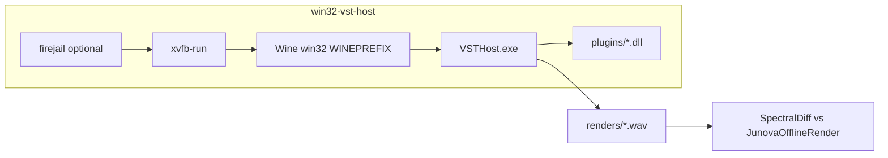

# Win32 VST sandbox — architecture

## Purpose

Run **32-bit Windows VST2** reference synths (Yonu60, RJU-60, Sixth Month June) on Linux amd64 Cloud/CI-dev VMs for **manual or semi-automated A/B** against Junova-X — without installing plugins into the host OS.

## Stack

| Layer | Role |
|-------|------|
| **firejail** | Network-off, private `/tmp`, read-only system except sandbox + `/workspace/build` |
| **Xvfb** | Virtual framebuffer so Wine GUI hosts run without a physical display |
| **Wine win32** | `WINEARCH=win32` prefix; 32-bit VST2 only |
| **VSTHost** | External donationware; not redistributed in git |
| **plugins/** | User/agent-supplied DLLs only |

## Why not Carla / yabridge?

- Repo **Carla** packages target **win64** bridges; our catalog plugins are **Win32 VST2**.
- **yabridge** targets 64-bit Windows plugins on Linux.

## Why not commit plugins?

License and malware risk. `plugins/` and `host/*.exe` are gitignored.

## Extension points

1. Ship tiny `.mid` files in `midi/` aligned with `GoldenScenarios`.
2. Add `render_performance.sh` when a VSTHost performance file is checked in for a given DLL.
3. Optional Docker image (`Dockerfile`) for reproducible Wine versions on non-Ubuntu agents.
