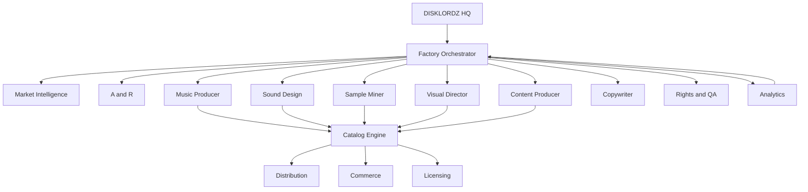

# DiskLordz Autonomous Music Factory — architecture

## Purpose

DiskLordz Autonomous Music Factory™ is an **AI-native record label + sample company + software lab**. YouTube and social are **top-of-funnel distribution**, not the business itself. The factory manufactures **batches** of catalog assets (tracks, stems, products, visuals, metadata), routes them through **human approval**, and feeds **Records**, **Supply**, and **Labs** from one catalog engine.

**Users:** DiskLordz operators (strategy, A&R, production, publishing) and future autonomous agents running the night shift with a morning approval queue.

## Build & run

| Component | Command |
|-----------|---------|
| **Factory API** | `cd disklordz-factory/apps/factory-api && python3 -m venv .venv && source .venv/bin/activate && pip install -r requirements.txt && uvicorn disklordz_factory.main:app --reload --port 8787` |
| **Dashboard + API** | `./disklordz-factory/scripts/run-factory-dev.sh` → http://127.0.0.1:5173 |
| **Night shift (API)** | `curl -s -X POST http://127.0.0.1:8787/night-shift/run -H 'Content-Type: application/json' -d '{"target_count":25}'` |
| **Health** | `curl -s http://127.0.0.1:8787/health` |
| **Catalog DB (dev)** | `sqlite3 ../../database/disklordz_catalog.db < ../../database/schema.sql` |

Frontend dashboard and n8n workflows are planned; this repo slice ships **schemas**, **SQL catalog**, **agent contracts**, and **API stubs**.

## Data flow

```text
DISCOVER → IDEATE → GENERATE → SELECT → PRODUCE → HUMANIZE → QA → PACKAGE
    → PUBLISH → DISTRIBUTE → MEASURE → LEARN → (next batch)
```



**Batch mindset:** the orchestrator asks *“What are the next N commercially interesting assets to manufacture?”* — not *“What song today?”*

**Humanization lane (sonic fingerprint):** AI brief → MIDI/stems → arrangement → MPC / SP-808 → hardware processing → resample → chop → layer → mix → master → catalog.

**Content multiplier:** one approved track spawns a cluster (YouTube, Shorts, streaming, sample/MIDI/preset products, email/social).

**Night shift:** agents run overnight; **07:00 approval queue** — publishing is not fully autonomous until rights and brand gates are proven.

## Threading / realtime

- **Factory API:** standard async FastAPI; no audio realtime requirements.
- **Audio QA agents:** run offline (FFmpeg, SoX, Python analysis) on worker processes — never on a live audio callback path.
- **JD Upgraded plugin** (sibling product in this monorepo): realtime rules apply only inside the VST/CLAP/standalone — see [docs/ARCHITECTURE.md](../docs/ARCHITECTURE.md).

## Key modules

| Path | Responsibility |
|------|----------------|
| `apps/factory-api/` | HTTP API: batches, approval queue, catalog CRUD stubs |
| `apps/dashboard/` | Future React operator UI (factory dashboard mock in docs) |
| `apps/catalog/` | Future catalog admin UI |
| `agents/*/` | Agent role contracts + prompts (12 core agents) |
| `workflows/` | Batch pipeline definitions (core loop, night shift) |
| `schemas/` | JSON Schema for assets, batches, opportunities |
| `database/` | SQLite/Postgres-ready catalog DDL |
| `prompts/` | Shared system prompts for orchestrator |
| `integrations/` | YouTube, Airtable, n8n, Slack hooks (stubs) |
| `docs/` | Filesystem layout for NAS (`DISKLORDZ/` tree) |

### Core agents (start with 12)

| Agent | Role |
|-------|------|
| Factory Orchestrator | CEO/producer; plans batches, delegates |
| Market Intelligence | Trends, keywords, product gaps |
| A&R | Select/reject releases; artist series |
| Creative Director | Brand + artist universe consistency |
| Music Producer | Production briefs (tempo, key, arrangement) |
| Sound Designer | Reusable sound families |
| Sample Miner | Track → kits, one-shots, MIDI, presets |
| Visual Director | Identity, artwork, video language |
| Content Producer | YouTube programming, Shorts |
| Copywriter | DR copy: feature → benefit → CTA |
| Rights & QA | Provenance, license, publish gate |
| Analytics | Performance → next batch rules |

### Artist universe (IP)

Fictional identities (e.g. DISKLORD 001–006) each define visual identity, BPM range, sound palette, lore, and production rules — not a pile of unrelated AI tracks.

### Three business engines

| Engine | Output |
|--------|--------|
| **DISKLORDZ RECORDS** | Music, YouTube, streaming |
| **DISKLORDZ SUPPLY** | Drums, samples, presets, MIDI |
| **DISKLORDZ LABS** | Plugins, tools (e.g. JD Upgraded in this repo) |

## Extension points

- **New agent:** add `agents/<name>/AGENT.md` + optional `prompts/<name>.md`; register in orchestrator mission schema.
- **New asset type:** extend `schemas/asset.json` prefixes (`DL-*`) and `database/schema.sql` `asset_kind`.
- **New workflow stage:** append to `workflows/core_loop.md` and API `BatchStage` enum in `factory-api`.
- **Integrations:** implement adapters under `integrations/` (YouTube upload, DistroKid, store webhooks).
- **Drum Factory:** sound-family tags on `DL-DRM-*` assets; fictional machines (DL-808, DL-SP808, …) as taxonomy, not trademark claims.

## YouTube network brands

Programmed channels (Boulevard 86, Midnight Circuit, Disklordz, Terminal Mirage) — [docs/DISKLORDZ_YOUTUBE_NETWORK.md](../docs/DISKLORDZ_YOUTUBE_NETWORK.md). Each brand links to a sourced `DL-OPP-*` before A&R assigns batches.

**Vintage collective + OpenClaw:** Four-artist 1970s–1980s soul/jazz/R&B synthesis orchestration — [docs/FACTORY_VINTAGE_COLLECTIVE.md](../docs/FACTORY_VINTAGE_COLLECTIVE.md). Roster seed: `database/artist_collective_seed.json`. API: `GET /collective/artists`.

**Research ingest:** `./scripts/ingest-youtube-network-research.sh` — four `DL-OPP-*` + greenlights ([docs/FACTORY_RESEARCH.md](../docs/FACTORY_RESEARCH.md)).

## Related docs

- [README.md](README.md) — quick start
- [docs/FOLDER_STRUCTURE.md](docs/FOLDER_STRUCTURE.md) — NAS / studio tree
- [docs/BUSINESS_ENGINES.md](docs/BUSINESS_ENGINES.md) — Records / Supply / Labs flywheel
- [workflows/core_loop.md](workflows/core_loop.md) — operating system stages
- [workflows/night_shift.md](workflows/night_shift.md) — autonomous schedule + approval
- [docs/FACTORY_VINTAGE_COLLECTIVE.md](../docs/FACTORY_VINTAGE_COLLECTIVE.md) — OpenClaw Workboard + four artist lanes
- Repo index: [ARCHITECTURE.md](../ARCHITECTURE.md)
- Plugin (Labs): [docs/ARCHITECTURE.md](../docs/ARCHITECTURE.md)
- CI / Slack: [scripts/setup-disklordz-integrations.sh](../scripts/setup-disklordz-integrations.sh)
