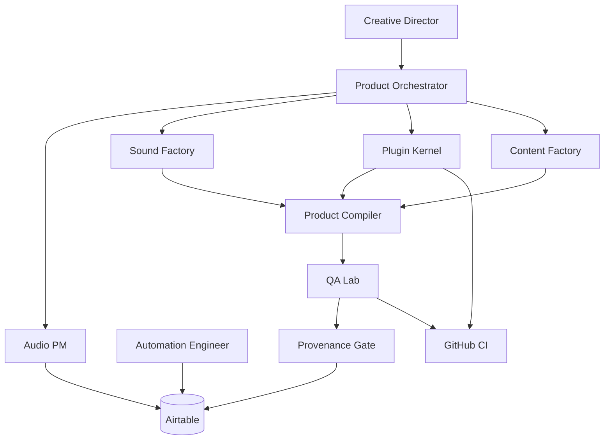

# DiskLordz Master Plan — Production Engine

**Goal:** An **autonomous audio-product company** with a **reusable production engine** (not a pile of one-off AI agents). **TRON Studio** provides orchestration + automation; **DiskLordz Audio Lab** is the first vertical proving it.

**North star:** [ARCHITECTURE.md](ARCHITECTURE.md) — **Audio Asset → Product Compiler** turns one creative idea into a **product family** (kits, plugins, presets, demos, content, bundles).

**Principle:** **Sound DNA** is atomic. Factories (Sound, Plugin, Content) + Compiler + QA/Provenance gates produce SKUs. Agents are **team roles** dispatched by the Orchestrator, not 25 separate personas.

---

## Phase 0 — Foundation (in progress)

| # | Deliverable | Owner | Done when |
|---|-------------|-------|-----------|
| 0.1 | Airtable base + extended schema | Audio PM | Tables incl. Families, Feedback, Signals |
| 0.2 | Docs: architecture, DNA, kernel, compiler, licensing, QA | Repo | `disklordz/docs/*` |
| 0.3 | Audio PM + Automation Engineer + **Product Orchestrator** skills | Repo | `.cursor/skills/disklordz-*` |
| 0.4 | Sound DNA JSON schema + product manifest schema | Repo | Validates in CI (planned) |
| 0.5 | Licensing posture documented | Repo | [LICENSING.md](LICENSING.md); VST3 ≥3.8 MIT, JUCE tier tracked |
| 0.6 | GitHub ↔ Airtable glue (Sprint A) | Automation Engineer | WO → issue live |

**Human gates:** Schema approval, first **sonic problem** brief, JUCE revenue tracking policy.

---

## Phase 1 — MVP compile (one product family slice)

**Outcome:** One **sonic problem** (e.g. *DIRTY DIGITAL DRUMS*) compiles to **plugin + kit + teaser + content pack** with provenance and QA gates.

```text
Brief → Product Family + Spec
     → Sound Factory (DNA + variants)
     → Plugin Kernel product module (from generator brief)
     → Preset Factory (factory + demo presets)
     → Product Compiler (manifest targets)
     → QA Lab profiles pass
     → Packaging + version matrix
     → Creative Director approval packet
```

| Subsystem | MVP scope |
|-----------|-----------|
| Sound DNA | Ingest + schema validate + Airtable rows |
| Sound Factory | Manual/script variant pipeline v0 |
| Plugin Kernel | Extract patterns from `MyFirstPlugin/` → first `products/DiskCrusher` |
| QA Lab | CI pluginval + provenance block script |
| Content Factory | Template-based copy + demo brief from spec |
| Commerce | Simple download + license PDF (no DRM) |

**Not in MVP:** DAW matrix automation, similarity embeddings, subscription, activation server.

---

## Phase 2 — Compiler automation

**Outcome:** `product-compiler` CLI (or workflow) runs from Airtable trigger; one brief spawns **multi-SKU family** per [PRODUCT_COMPILER.md](PRODUCT_COMPILER.md).

- Orchestrator reads manifest + dispatches **team roles** (not new agents per SKU).  
- Demo Generator produces before/after audio.  
- Intelligence loop v0: Feedback table → improvement WOs.

---

## Phase 3 — Kernel + Character Lab scale

**Outcome:** New plugin = brief + DSP module + UI skin; new sounds = Character Lab batch + variant explosion.

- Plugin Generator scaffolds `products/<slug>/`.  
- Knowledge graph (`Asset Relations`) powers reuse scoring in Intelligence.  
- DAW compatibility matrix maintained in QA.

---

## Phase 4 — Autopilot + catalog ladder

**Outcome:** Market signals → proposed compiles; free → paid ladder filled; weekly digest only touchpoint.

| System | Role |
|--------|------|
| Airtable | Products, families, DNA, WOs, feedback, signals, DAW matrix |
| GitHub | Kernel, products, factories, CI + QA profiles |
| Compiler | Manifest-driven releases |
| Zapier/n8n | Triggers, digests, store hooks |
| Cloud Agents | Engineering + sound implementation under Orchestrator |

**Exit criteria:** Brief → family compile → approval packet with **no manual file shuffling**; provenance block enforced; JUCE/VST3 compliance documented per release.

---

## Team model (not agent sprawl)

```text
Creative Director (human)
        │
        ▼
 Product Orchestrator ──► dispatches TEAM ROLES on Work Orders
        │
        ├── Audio PM (Airtable truth, cadence)
        ├── Workflow Automation Engineer (glue until done)
        │
        ├── PRODUCT TEAM (spec, sonic problem, UX, copy, intelligence)
        ├── SOUND TEAM (factory, DNA, kits)
        ├── ENGINEERING TEAM (kernel, generator, build, QA lab)
        └── RELEASE TEAM (compiler, packaging, store v1)
```

See [AGENTS.md](../AGENTS.md) for role → skill mapping.

---

## Commercial ladder (build catalog before subscription)

Free teaser → $9–19 mini → $29–49 kit → $49–99 plugin → bundles → collections → (later) all-access.

Products table: `ladder_tier` + `product_family` link.

---

## Architecture diagram



---

## Immediate execution steps

1. Create Airtable base from `airtable/base-schema.json` (v2 fields).  
2. Run **Product Orchestrator** with first family brief + compile targets.  
3. Automation Engineer: Sprint A + **provenance_check** script in compiler path.  
4. Engineering: begin `plugin-kernel/` extraction from `MyFirstPlugin`.  
5. Sound: ingest 10 assets with full DNA + `commercial_ok: true`.

---

## Risks

| Risk | Mitigation |
|------|------------|
| JUCE license limits | Revenue tracking; upgrade path in LICENSING.md |
| Sample provenance | Compiler hard block |
| Agent sprawl | Orchestrator + teams only |
| Kernel not shared | No second plugin until kernel MVP merged |
| QA trust in LLM only | QA Lab profiles mandatory |

---

## Success definition

**DiskLordz runs as a factory when:** A sonic-problem brief compiles to a **product family**, all assets pass DNA + provenance, QA profiles pass, content + demos generate from spec, and you only **listen and approve** `Released` — with every SKU traceable to Sound DNA and version matrix.
