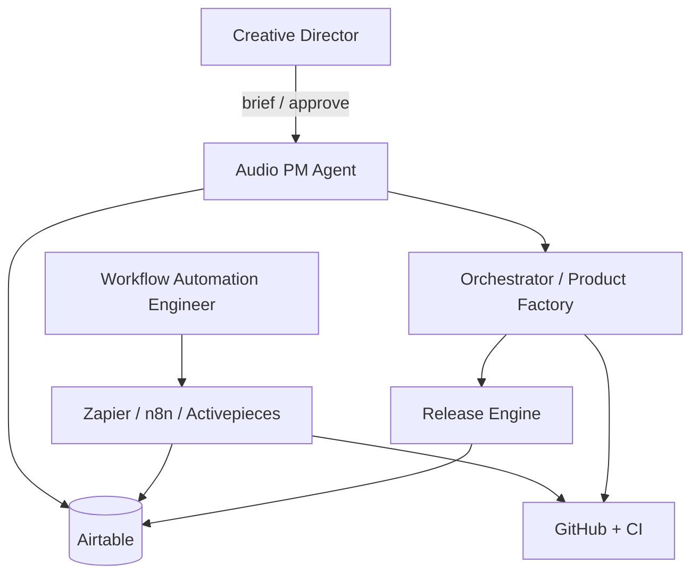

# DiskLordz Master Plan — Agent-Operated Audio Company

**Goal:** One production pipeline that ships **VST3 plugins**, **drum kits**, and **expansions** with you as Creative Director only. Cloud Agents + Airtable + workflow automation are the factory floor.

**Principle:** The **sound asset** is atomic. Every WAV carries metadata; products (kit, plugin preset pack, MPC program, zip) are **views** over that library.

---

## Phase 0 — Foundation (you are here)

**Outcome:** Shared language, system of record, and two “meta” agents that manage everything else.

| # | Deliverable | Owner agent | Done when |
|---|-------------|-------------|-----------|
| 0.1 | Airtable base from `airtable/base-schema.json` | Audio PM + you | Tables live; enums match doc |
| 0.2 | Audio PM skill + operating model | This repo | PM can create/update records via API/MCP |
| 0.3 | Workflow Automation Engineer skill + roadmap | This repo | Backlog in Airtable `Automations` |
| 0.4 | GitHub org/repos aligned to layout in `disklordz/README.md` | Automation Engineer | Issues/PRs link to Airtable IDs |
| 0.5 | Secrets map (1Password / env) — no keys in git | Automation Engineer | Documented in private runbook |

**Human gates in Phase 0:** Approve Airtable schema, brand naming, first product brief.

---

## Phase 1 — Single “factory product” (MVP)

**Outcome:** One shippable **plugin + companion kit** end-to-end without you touching CMake or file renaming.

Pick one vertical slice, e.g. *“1999 digital sampler crush on drums”*:

```text
Creative brief (you)
    → Audio PM: Product + Project in Airtable
    → Product Director spec (agent)
    → Parallel: Plugin track | Sample track
    → Release Agent: zip + metadata
    → QA agents: build/load + audio checks
    → Store-ready folder (manual or Gumroad/Lemon Squeezy later)
```

| Track | Agents (skills to add next) | Artifact |
|-------|----------------------------|----------|
| Plugin | Architect → DSP → JUCE → UI → Plugin QA | `.vst3` + presets |
| Samples | Sound Designer → Processor → Kit Architect | `WAV/` + `PRODUCT_INFO.json` |
| Formats | MPC Agent (optional v1) | `MPC/` folder |
| Release | Release Agent | `DiskLordz_*_Vol_1.zip` |

**Automation targets for Phase 1:**

1. New row in `Products` → GitHub issue + branch naming convention.
2. PR merged → update `Products.status` + notify Slack (optional).
3. Nightly: stale `Agent Work Orders` → PM summary.

**Human gates:** Final sound check, cover art approval, price/publish.

---

## Phase 2 — Product Factory Agent

**Outcome:** One command — *“Make a dark 90s digital drum machine kit”* — runs the orchestrated pipeline with status in Airtable.

- **Product Factory** skill orchestrates sub-agents (Task tool / parallel Cloud Agents).
- Each step writes **Work Order** completion + artifacts path.
- Failure → retry policy + PM escalation record.

**Metrics:** Time from `Briefed` → `Released`; % steps without human intervention.

---

## Phase 3 — Full division roster (12 agents)

Deploy skills/rules per role from your architecture diagram. Priority order after Factory:

1. Plugin QA (blocks bad releases)
2. Sample Processing (scale library)
3. Release Agent (consistent zips)
4. Remaining specialists as parallel capacity allows

---

## Phase 4 — Business autopilot

**Outcome:** Pipeline runs on schedules and events; you only approve releases and creative pivots.

| System | Role |
|--------|------|
| **Airtable** | Products, projects, assets, work orders, automation registry |
| **GitHub** | Code, CI (plugin build + pluginval), agent PRs |
| **Zapier / n8n / Activepieces** | Glue: Airtable ↔ GitHub ↔ storage ↔ notifications |
| **Cursor Cloud Agents** | Implementation, QA with computer use, long-running automation work |
| **Object storage** | Canonical WAV + release zips (S3/R2 — when ready) |

**Automation Engineer mandate:** Reduce manual steps each sprint until Phase 4 exit criteria are met:

- [ ] New product brief → tracked project without manual ticket creation  
- [ ] Sample ingest → normalized library row + files without manual rename  
- [ ] Plugin CI green → release candidate row auto-updated  
- [ ] Release zip → generated from template without manual folder copy  
- [ ] Weekly digest → auto-generated for Creative Director  

---

## Architecture (reference)



---

## Immediate next steps (after this plan)

1. **You:** Create Airtable base from schema (or share base ID for API wiring).
2. **Audio PM agent run:** Import schema; create first `Product` + `Project` for MVP slice.
3. **Automation Engineer run:** Enable Zapier Airtable actions (or n8n self-host); implement Work Order → GitHub issue flow.
4. **Cloud environment:** Extend `environment.json` with Linux audio deps + JUCE build (already partially in `MyFirstPlugin/build.sh`).
5. **First parallel agents:** Product spec skill + Sample Processing skill (Phase 1).

---

## Risks and mitigations

| Risk | Mitigation |
|------|------------|
| Agent writes code that doesn’t compile | Plugin QA + CI pluginval; no release without green CI |
| Airtable drift from reality | PM owns weekly reconcile; GitHub PR links required on work orders |
| Automation fragility | Automation Engineer: idempotent workflows, logging table in Airtable |
| Taste / brand | Hard human gate on `Ready to Publish` status |
| IP / licensing on samples | Metadata field `provenance`; block release if empty |

---

## Success definition

**DiskLordz is “running on its own” when:** A new product brief triggers a tracked project, agents complete work orders through release candidate, CI and QA pass, and you receive a single approval packet (listen link + zip + copy) — with all status visible in Airtable without you chasing repos.
