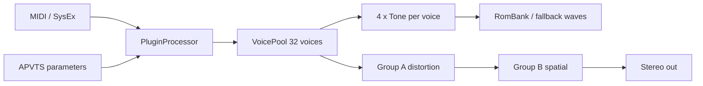

# JD Upgraded — architecture

Agent-oriented overview of the **JD Upgraded** synthesizer (VST3 + standalone). Repo index: [ARCHITECTURE.md](../ARCHITECTURE.md). Offline tools: [tools/ARCHITECTURE.md](../tools/ARCHITECTURE.md).

## Purpose

Playable four-tone-per-voice PCM synth inspired by Roland JD-800 / JD-990 ergonomics, using a **clean-room ROM** (`JDUPGROM`) and partial **JD patch SysEx** import. No Roland wave dumps ship with the product.

## High-level signal flow

## Runtime model

| Thread | Work |
|--------|------|
| **Audio** | `processBlock` → `VoicePool::render` → master FX. **No heap allocation** on this path; scratch in `outputScratch_`. |
| **UI** | `PluginEditor` reads/writes APVTS; program changes call `applyFactoryPatch` / `applyPatchesFromParameters`. |
| **Message** | SysEx in `handleMidi` → `JdPatchSysexMapper` → APVTS + `applyJdPatchCoarsePitch` (coarse/fine, pitch env, LFO1). |

Control-rate envelopes advance every `kControlRateDivisor` (32) samples inside each `Tone`.

## Voice / tone DSP

- **`VoicePool`** — note allocation, 32 `SynthVoice`, each with 4 `Tone`.
- **`SynthVoice`** — coupling modes (ring, cross-mod, hard sync on pairs 0–1 / 2–3); SIMD `addBuffers` for off-pair tones in coupled modes ([Simd/VoiceSimd.h](../Source/DSP/Simd/VoiceSimd.h)).
- **`Tone`** — `SampleEngine` (PCM + pitch), pitch / filter / amp `RateLevelEnvelope`, `ZdfTvf`, optional LFO1 vibrato on pitch.
- **`TonePatch`** — per-voice snapshot built in `applyPatchesFromParameters()` from APVTS + internal arrays (`toneCoarseSemis_`, `toneFineCents_`, `tonePitchMod_` from SysEx).

## Parameters & programs

- **APVTS** created in `createParameterLayout()` — levels, waves, multisamples, mutes, global/per-tone ADSR, per-tone TVF, filter link, coupling choice, Group A/B macros.
- **128 factory programs** — `FactoryPatchLibrary`; `currentProgram_` persisted in plugin state.
- **User ROM** — `RomLoader` + optional `JDUPGRADED_ROM_PATH` ([USER_ROM.md](USER_ROM.md)).

## Preset import

- **SysEx / 384-byte patch** — [SYSEX.md](SYSEX.md), `JdPatchSysexMapper`, layout in `JdPatchLayout.h`.
- **Pitch mod decode** — `JdTonePitchMod.h` (pitch envelope bytes, LFO1 rate/sens, fine cents).
- **Internal blob** — `ApvtsBridge` / `JDPR` stub for experiments.

## Assets

| Component | Location |
|-----------|----------|
| ROM binary | Build-generated `jdupg_cleanroom.rom` → `JDUpgradedRomData` |
| ROM API | `Source/Assets/RomBank.*`, `RomLoader.h` |
| Fallback waves | `CleanroomWaveLibrary` when ROM unloaded |
| Factory patches | `FactoryPatchLibrary.cpp` |

## UI

`PluginEditor` — program selector, tone strips, filter, coupling, Group A/B, envelope link + tone selector, wave palette combos (`WavePalette.h`).

## Build targets

- `JDUpgraded_VST3`, `JDUpgraded_Standalone` — `juce_add_plugin` in root `CMakeLists.txt`.
- SIMD: `-mavx2` when available, else NEON define for ARM.

## Testing & regression

- **Determinism:** two `OfflineRender` runs must match (`SpectralDiff`).
- **Golden WAVs:** `tests/golden/manifest.tsv` (6 programs) — `verify_golden.sh` in CI ([AB_HARNESS.md](AB_HARNESS.md)).

## Extension points

| Goal | Start here |
|------|------------|
| New parameter | `createParameterLayout`, `refreshCachedParameters`, `applyPatchesFromParameters` |
| New DSP per tone | `Tone.h` / `TonePatch`, voice render in `SynthVoice.h` |
| SysEx field | `JdPatchLayout.h`, `JdPatchSysexMapper.cpp`, optional `JdTonePitchMod` |
| New factory program | `FactoryPatchLibrary.cpp` |
| Master FX | `GroupADistortion` + `groupAEnable`; `GroupBSpatial` + `groupBEnable` / `groupBChorus` |

## Related docs

- [HANDOFF.md](HANDOFF.md) — branch status for agents  
- [PHASE5.md](PHASE5.md) — roadmap  
- [SYSEX.md](SYSEX.md), [ROM.md](ROM.md), [PRESETS.md](PRESETS.md)
