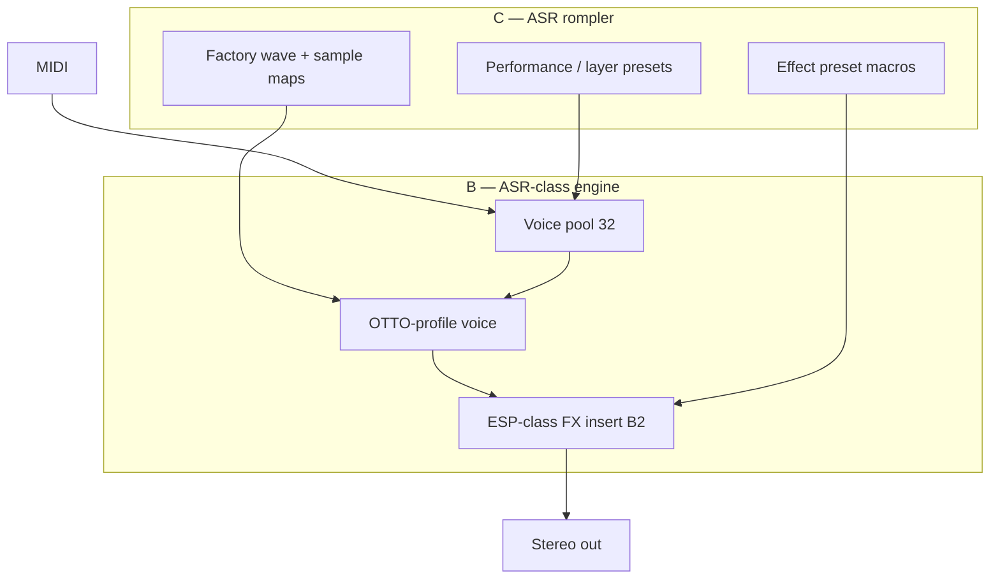

# ASR-10–class rompler (B + C) — product architecture

**Status:** planned SKU (not in root CMake yet)  
**Sibling:** [EPS-class rompler (B + C)](EPS_CLASS_ROMPLER.md) — same strategy, different silicon profile and UX story  
**Not in scope:** Full OS / ROM emulation (class A — e.g. [MAME `esqasr.cpp`](https://github.com/mamedev/mame/blob/master/src/mame/ensoniq/esqasr.cpp), preliminary)

## Purpose

Ship a **rompler** (C) whose playback and tone stack **behaves like an Ensoniq ASR-10–class workstation sampler** (B): OTTO-style voices, onboard-style **effects character**, layers/performance workflow — without 68302 firmware, Ensoniq ROM/OS disks, or SCSI/floppy compatibility claims.

Marketing: **“ASR-class / 90s Ensoniq workstation inspired”**, not “ASR-10 emulator.”

## EPS vs ASR (why this is a sibling SKU, not a skin)

| | **EPS-16 Plus (class)** | **ASR-10 (class)** |
|---|-------------------------|---------------------|
| Sample chip | ES5505 (OTIS) | ES5506 (OTTO) — higher internal precision, optional compressed samples, stronger pan/envelope hooks |
| Effects | ES5510 host path (simpler in mix) | **ES5510 ESP** is central to the ASR sound (reverb, chorus, EQ-ish programs) |
| CPU / OS (class A only) | 68000 @ 10 MHz, EPS memory map | MC68302 @ 16 MHz, different map, sequencer/workstation OS |
| Class **C** UX metaphor | Disk/instrument load, 8 tracks | **Performance**, layers, mute/solo, effect presets, “kit” workflows |
| Class **B** parity reference | [mardlib `es5505_core`](https://github.com/mardlib/Ensoniq-EPS-16-Plus/tree/vst3-prototype/native) | MAME ES5506 + ES5510 models (behavioral targets only) |

**Shared platform:** one JUCE/HISE **content model** (zone maps, presets). Two **engine profiles** (`otis5505` vs `otto5506`) plus ASR-only **post-voice FX block** (B2).

## B + C split (ASR)

| Layer | Letter | ASR-specific deliverables |
|-------|--------|---------------------------|
| **C** | Rompler | Multisamples + **factory waves** (clean-room or licensed, not Ensoniq wave ROM dumps); performance/layer presets; effect preset names that do not copy OS strings. |
| **B1** | Voice | ES5506-style voice: addressing, interpolation, volume/pan law, four-pole filters, 32 voices — profile `otto5506`. |
| **B2** | Effects | Simplified **ESP-class insert** (serial: dry voice → reverb/chorus/delay macros). Not cycle-accurate ES5510 microcode; golden-match **audio** to reference renders. |

Phase 1 (HISE) can approximate B2 with built-in HISE FX; Phase 2 (JUCE) replaces with deterministic offline-testable DSP.

## High-level data flow

## Build and run (by phase)

Same gates as EPS: Planner `product_id` (example: `DL-ASR-CLASS-ROMPLER`), Marketing brief, `[Plugin][HISE]` for sketch.

| Phase | Path | Owner |
|-------|------|--------|
| 1 — C (+ FX in HISE) | `hise-sketch/AsrClass/` | Antigravity |
| 2 — B1 + B2 in JUCE | `AsrClass/` CMake targets (TBD) | Cursor after port WO |

**Efficiency option:** implement **shared** `EnsoniqClass/DSP/` (zone maps, voice pool shell) once; EPS and ASR ship as two plugins or one plugin with “machine profile” — Marketing decides SKU count.

## B1 — voice specification (OTTO profile)

Inherit the [EPS B checklist](EPS_CLASS_ROMPLER.md#b--engine-specification-behavioral) and add OTTO deltas as tested flags:

1. **Precision** — document 18-bit internal path vs EPS 16-bit (float pipeline with documented rounding).
2. **Pan / routing** — stereo pan law per voice before FX insert (ASR hallmark).
3. **Optional compression** — if content uses compressed maps, decode offline to PCM at load time for v1 (no on-the-fly Ensoniq compression in v0).

## B2 — effects specification (behavioral ESP)

1. **Insert only** — no host-CPU “upload 322 DSP instructions” simulation.
2. **Macro set** — small fixed library (e.g. Room/Hall, Chorus Wide, Plate) mapped from ASR-ish parameters (decay, predelay, LFO rate).
3. **Testing** — impulse + sine sweeps through each macro; compare to reference WAVs captured from hardware or approved sim (not shipped in repo).

## C — content specification

1. **Wave + sample library** — ASR identity is half factory waves, half user-style multis; all **original or licensed** captures.
2. **Performances** — map layers to MIDI zones or key switches; HISE `ScriptPanel` or JUCE UI — not OS “Song/Sequence” emulation.
3. **Preset interchange** — same container format as EPS-class where possible (shared `ZoneMap` + JSON preset schema with `profile: "otto5506"`).

## Explicit non-goals (ASR class A)

68302 boot, Ensoniq OS ROM, `.IMG`/SCSI images, sequencer disk formats, KPC/VFD protocol, built-in **Ensoniq** wave ROM binary redistribution.

## Related docs

- [ENSONIQ_SAMPLE_AUTHORING.md](ENSONIQ_SAMPLE_AUTHORING.md) — record, multisample, HISE import
- [EPS_CLASS_ROMPLER.md](EPS_CLASS_ROMPLER.md)
- [ENSONIQ_CLASS_SAMPLER_PLATFORM.md](ENSONIQ_CLASS_SAMPLER_PLATFORM.md)
- [HISE_ANTIGRAVITY_LANE.md](HISE_ANTIGRAVITY_LANE.md)
- [DISKLORDZ_PLUGIN_TRACKS.md](DISKLORDZ_PLUGIN_TRACKS.md)
