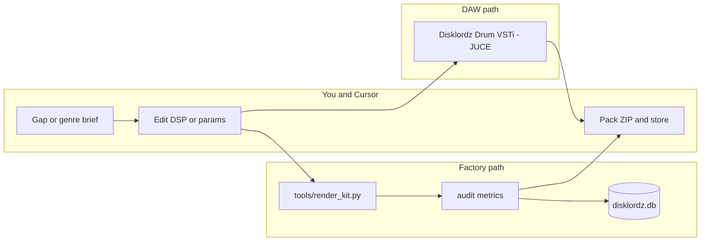

# Disklordz blueprint (Cursor-native)

> **Factory status:** **ACTIVE** — [DISKLORDZ_FACTORY_PLAN.md](DISKLORDZ_FACTORY_PLAN.md) · [projects/ACTIVE_disklordz_factory.md](projects/ACTIVE_disklordz_factory.md) · PM: [Audio PM Agent](pm-agent/DISKLORDZ_AUDIO_PM_AGENT.md)

This document distills the January Gemini archives (**Master Dossier**, **Chat Compendium**, **Autonomous Enterprise**) into something you can actually build in this repo—without Agent Zero, fake dashboards, or 15-agent theater.

**Sample pack brand (phonk/trap chat):** [DISKLORDZ_SAMPLE_PACK_BRAND.md](DISKLORDZ_SAMPLE_PACK_BRAND.md) · **Hardware sessions:** [DISKLORDZ_CAPTURE_LIST.md](DISKLORDZ_CAPTURE_LIST.md)

## What we kept

| Idea | Role |
|------|------|
| **Procedural drums** | Generate WAVs (batch) and/or play them in a **JUCE VSTi** (real-time) |
| **Hardware-inspired math** | 808 pitch decay, SP-1200 grit, Memphis cowbell, trap pitch sweep |
| **Sample DNA** | SQLite rows: freq, decay, grit, bit depth, paths, QA metrics |
| **Spectral QA** | RMS, crest factor, ZCR; optional match vs reference kits |
| **Scarcity / ledger** | Business rules in `product_ledger` when you sell—not autonomous loops |
| **Slack** | Optional webhook when a batch finishes (`tools/render_kit.py`) |

## What we dropped

- **Agent Zero X**, event-driven “CEO” orchestrators, `orchestrator.py`-style infinite loops
- **React `App.jsx` command center** (simulated revenue and gaps)
- **15-agent enterprise fleet** as runtime code (prompts are fine as *manual* Cursor checklists when launching a kit)
- **`conversation_memory`** (use git + Cursor threads)
- **MCP as “neural memory”** — MCP is for tools (e.g. Slack); catalog lives in SQLite + the repo

## Architecture (you + Cursor + two engines)

| Path | When to use |
|------|-------------|
| **JUCE VSTi** (`MyFirstSynth` → Disklordz Drum) | MIDI in the DAW, automation, sound design |
| **Python factory** (`tools/`) | Overnight grids, pack generation, DNA seeding |

DSP formulas in Python and C++ should stay **aligned** (same envelopes and ratios); see [DSP specifications](#dsp-specifications).

## DSP specifications

### TR-808 sub (phonk)

Pitch envelope: \(f(t) = f_{\text{start}} e^{-k t} + f_{\text{base}}\).

Body: damped sine with amplitude \(e^{-\alpha t}\). Defaults in the factory: \(f_{\text{start}} \approx 45\) Hz, \(f_{\text{base}} \approx 42\) Hz, \(k \approx 5\).

### Atlanta trap 808

Fast sweep: \(f(t) = (4 f_0) e^{-30 t} + f_0\), amplitude \(e^{-1.5 t / \text{decay}}\), soft clip.

### SP-1200 character

12-bit quantization, optional decimation toward ~26 kHz, hard clip / drive.

### Memphis cowbell (TR-808 style)

Two square waves at \(f_0\) and \(1.481 f_0\), envelope \(e^{-6 t / \text{decay}}\).

### Hi-hat / snare (noise)

High-passed differenced noise + exponential decay; trap snare adds ~180 Hz tone body.

### “SonicFactory” kick (enterprise doc)

Sub sweep + stochastic noise transient, then \(\tanh(k \cdot x)\) (default \(k \approx 3.2\)). Implemented as `synthesis.obsidian_kick()` in `tools/disklordz/synthesis.py`.

### QA metrics (Local Auditor / Digital Twin)

| Metric | Meaning |
|--------|---------|
| **RMS** | Overall level |
| **Crest factor** | \(\|peak\| / (\text{RMS} + \epsilon)\) — punch |
| **ZCR** | Zero-crossing rate — noise/texture |
| **Sub peak (FFT)** | Dominant energy in 38–52 Hz for 808-style subs |

Reference matching (optional): compare crest and ZCR to means from `references/` — see `tools/disklordz/references.py`. Target match score ≥ 80% is a **guideline**, not an auto-swarm gate; you decide in CI or before shipping.

## Database

Single file (default `tools/data/disklordz.db`). DDL: `tools/schema.sql`.

Core tables: `sample_dna`, `spectral_references`, `batch_runs`, `product_ledger`, `market_gaps` (manual research only).

## JUCE plugin target: Disklordz Drum

Fork **`MyFirstSynth`** (not the effect demo). Map APVTS parameters to the same fields as `sample_dna`:

| Parameter | Typical range | Maps to |
|-----------|----------------|---------|
| `voice` | 808 phonk / trap / cowbell / hat | generator |
| `fundamentalHz` | 36–52 | `freq_peak` |
| `pitchDecay` | 0.1–2 s | decay |
| `grit` | 0–1 | drive / SP amount |
| `bitDepth` | 12–16 | SP-1200 flavor |
| `outputGainDb` | -24–6 | level |

Use `MyFirstPlugin/CURSOR_COMPOSER_PROMPT.md` with:

- **Plugin Name:** Disklordz Drum  
- **Plugin Type:** VSTi Synth Instrument  
- **Core features:** list the four voices above + APVTS + RT-safe voices  

Processor first; editor second—same rule as the rest of this repo.

## Phased roadmap (revised)

### Phase 1 — Memory and factory (this repo)

- [x] Schema + `render_kit.py` batch exporter  
- [ ] Seed `references/` from commercial or your own kicks → `python -m tools.profile_references`  
- [ ] Tune QA thresholds in `tools/disklordz/audit.py` for your genre  

### Phase 2 — Real-time instrument

- [ ] Disklordz Drum VSTi from `MyFirstSynth`  
- [ ] Export preset → same params as a `sample_dna` row (manual or small script)  

### Phase 3 — Commerce (outside repo)

- Storefront, scarcity caps on `product_ledger`, marketing copy via Cursor (use enterprise **prompts** as one-shot instructions—not Python agents)  
- Slack MCP or webhook for “kit shipped”  

## Enterprise doc prompts (optional, manual)

The **15-agent** prompts in the Autonomous Enterprise archive are useful when **you** run a launch in Cursor:

1. Social listening → paste findings into `market_gaps`  
2. Customer persona → ad copy  
3. Compliance → review claims before ads  

Do not implement `drum_agents.py` sequential runners unless you want a demo script.

## Related files

| Path | Purpose |
|------|---------|
| [DISKLORDZ_SAMPLE_PACK_BRAND.md](DISKLORDZ_SAMPLE_PACK_BRAND.md) | Brand lane (phonk/trap transcript, keep/ditch) |
| [DISKLORDZ_CAPTURE_LIST.md](DISKLORDZ_CAPTURE_LIST.md) | Sector 01 hardware capture checklist |
| `DISKLORDZ_BRAND_PROMPT.txt` | Paste into Cursor / other AI for copy & art |
| [DISKLORDZ_RUN_SHEET.md](DISKLORDZ_RUN_SHEET.md) | 4-Square release checklist (Cursor-only) |
| `tools/README.md` | How to run the factory |
| `tools/schema.sql` | SQLite DDL |
| `tools/render_kit.py` | CLI batch render |
| `MyFirstPlugin/` | JUCE build (effect + synth templates) |
