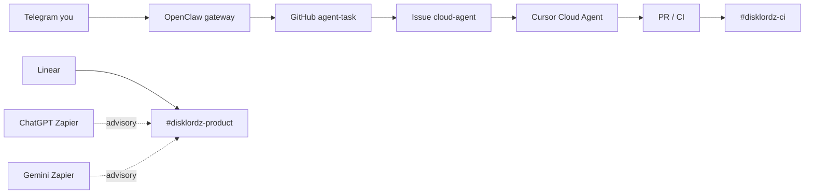

# Disklordz — integrations (Slack, Linear, Cursor, Telegram / OpenClaw)

## Stack map

| Layer | Tool | Role |
|-------|------|------|
| Implementation | **Cursor Cloud Agent** + GitHub `Instruments` | Code, PRs, CI, golden tests |
| Team comms | **Slack** `#disklordz*` | Dev, product, CI, shipped |
| Work tracking | **Linear** (+ MCP in Cursor) | Issues, cycles, roadmap |
| Advisory / glue | **ChatGPT** & **Gemini** (Zapier) | Drafting, summaries — not repo owners |
| Personal mobile | **Telegram** (you only) | Alerts + queue agent tasks |
| Local assistant | **OpenClaw** + Telebot | Your private gateway to the same GitHub queue |

## Slack

| Channel | ID | Use |
|---------|-----|-----|
| `#disklordz` | `C0C2AK80XCN` | Home / stack |
| `#disklordz-dev` | `C0C1X6S61B9` | Code & agents |
| `#disklordz-product` | `C0C2G7S8K0U` | Product & Linear echoes |
| `#disklordz-ci` | `C0C1X6RMGTZ` | CI notifications |
| `#disklordz-shipped` | `C0C2AK7R8MU` | Releases |

Setup: `./scripts/setup-disklordz-integrations.sh slack-ci --webhook-url '…'`

## Linear MCP (Cursor)

Repo file: [`.cursor/mcp.json`](../.cursor/mcp.json)

1. Pull latest `main`.
2. **Cursor → Settings → MCP** → enable **linear** → complete **OAuth** (Linear docs: [MCP server](https://linear.app/docs/mcp)).
3. Use Linear inside Composer for issue context; Cloud Agent still commits via GitHub.

**Zapier (optional):** Linear actions are enabled on Zapier MCP — authenticate at mcp.zapier.com if agents should create/update issues without native Linear MCP.

## Cursor Cloud Agent

- Environment: [`.cursor/environment.json`](../.cursor/environment.json)
- Agent rules: [`AGENTS.md`](../AGENTS.md)
- Queue from shell: [`scripts/trigger-agent-task.sh`](../scripts/trigger-agent-task.sh)
- Queue from GitHub UI: **Actions → Cloud agent task → Run workflow**

## OpenClaw + Telebot — best role (personal, not team)

[OpenClaw](https://github.com/openclaw/openclaw) is a **local-first gateway** (Telegram, Slack, many channels). There is no separate “OpenClaw 2.0” product line in the upstream repo — use current releases (e.g. `openclaw@latest`) and [Telegram channel docs](https://docs.openclaw.ai/channels/telegram).

**Recommended role for Disklordz (Telegram = you only):**

| Do | Don’t |
|----|--------|
| DM **status**: last CI, link to open PR, “what shipped” | Replace `#disklordz-dev` for team discussion |
| **Queue** work: natural language → `trigger-agent-task.sh` or `repository_dispatch` | Merge PRs or push to `main` without confirmation |
| **Pairing** (`dmPolicy: pairing`) so only your Telegram user ID talks to the bot | Expose bot to customers or public groups |
| **Reminders** / capture ideas → Linear issue (Zapier) or agent-task issue | Run arbitrary shell on your dev machine without sandboxing |

**Minimal OpenClaw pattern**

1. `openclaw onboard` on a machine you control.
2. BotFather token → `channels.telegram.botToken`, `dmPolicy: "pairing"`, allowlist **your** user ID.
3. Add a skill or hook that runs:
   `scripts/trigger-agent-task.sh telegram "<user message>"`
4. Reply in Telegram with the GitHub Actions run URL + issue link when queued.

Antigravity / VS Code / Grokbot **do not** need Slack; they use the same git remote. OpenClaw does **not** remote-control Antigravity — it **feeds** the GitHub/Cursor pipeline.

## Zapier sketches (enable apps in mcp.zapier.com)

Authenticate after enabling:

- **Linear:** https://mcp.zapier.com (LinearCLIAPI)
- **Gemini:** Google AI Studio (Gemini)
- **Telegram:** TelegramCLIAPI

### Zap 1 — Linear → `#disklordz-product`

| Step | App | Action |
|------|-----|--------|
| Trigger | Linear | Issue created (filter: team = Disklordz / Instruments) |
| Action | Slack | Send channel message → `#disklordz-product` |
| Body | | Title, assignee, priority, link to Linear issue |

Native alternative: Linear → Slack integration in Linear settings (often simpler than Zapier).

### Zap 2 — CI fail → your Telegram (personal)

| Step | App | Action |
|------|-----|--------|
| Trigger | GitHub | Workflow run → failed (repo `Instruments`, workflows Build / Build MyFirstPlugin) |
| Filter | | Branch `main` or `cursor/**` |
| Action | Telegram | Send message → your chat ID |
| Body | | Workflow name, branch, link to run; optional “Reply fix to queue agent” hint |

Parallel: `#disklordz-ci` via `SLACK_WEBHOOK_URL` + [ci-slack-notify.yml](../.github/workflows/ci-slack-notify.yml).

### Zap 3 (optional) — Gemini advisory on long threads

| Step | App | Action |
|------|-----|--------|
| Trigger | Slack | New message in `#disklordz-product` with keyword `?advisory` |
| Action | Gemini | Send prompt — summarize thread + risks only (no code write) |
| Action | Slack | Post reply in thread |

## Auth checklist

| Integration | You complete once |
|-------------|-------------------|
| Linear MCP | Cursor MCP OAuth |
| Linear / Gemini / Telegram Zapier | Visit auth URLs from Zapier MCP after enable |
| Slack CI webhook | `setup-disklordz-integrations.sh slack-ci` on your machine |
| OpenClaw Telegram | BotFather + pairing approve |
| Cursor ↔ GitHub | Cursor Cloud Agents settings |
