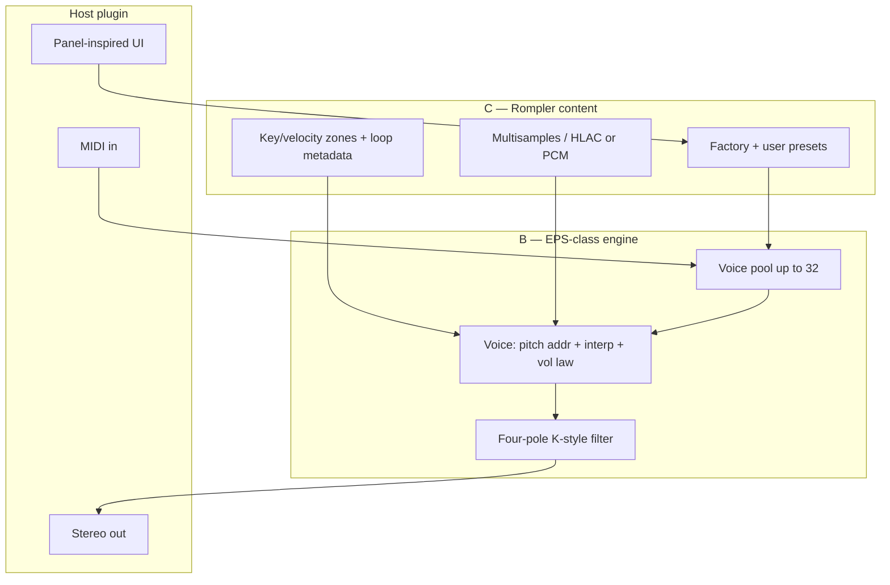

# EPS-class rompler (B + C) — product architecture

**Status:** planned SKU (not in root CMake yet)  
**Platform:** shared engine/content strategy with [ASR-class rompler](ASR_CLASS_ROMPLER.md) — see [ENSONIQ_CLASS_SAMPLER_PLATFORM.md](ENSONIQ_CLASS_SAMPLER_PLATFORM.md)  
**Tracks:** [HISE sketch (C)](HISE_SKETCH_LANE.md) first → optional [JUCE factory port (B)](DISKLORDZ_PLUGIN_TRACKS.md)  
**Not in scope:** Full OS / ROM emulation ([mardlib/Ensoniq-EPS-16-Plus](https://github.com/mardlib/Ensoniq-EPS-16-Plus) class A)

## Purpose

Ship a **customer-facing rompler** (C) whose playback and tone stack **behaves like an Ensoniq EPS-class sampler** (B) — without running original firmware, shipping ROM dumps, or claiming disk/OS compatibility.

| Layer | Letter | What it is |
|-------|--------|------------|
| **Content** | **C** | Multisampled instruments, factory presets, Disklordz-branded UX (LOAD-style workflow *as metaphor*, not OS clone). |
| **Engine** | **B** | Deterministic voice DSP: EPS-like addressing, interpolation, volume law, four-pole filter topology, 32-voice pool — fed from **your** sample maps only. |

Marketing must position as **“EPS-class / vintage sampler inspired”**, not “EPS-16 Plus emulator.”

## Who uses it

- Producers wanting **classic sampler character** (filters, loops, layer stacks) with modern DAW integration.
- Disklordz plugin ladder under **digital sampler / rompler** family (see Airtable `DL-FAMILY-DIGITAL-SAMPLER` in [hise-sketch-lane seed](../disklordz/airtable/seed/hise-sketch-lane-2026.json)).

## High-level data flow

## Build and run (by phase)

### Phase 0 — gates (Planner + Marketing)

- New `product_id` (example: `DL-EPS-CLASS-ROMPLER`), brief, price tier, sample licensing story.
- WO prefix: `[Plugin][HISE]` for sketch; `[Plugin][HISE-Port]` or dedicated prefix when opening JUCE port.

### Phase 1 — C on HISE (Track D, Antigravity)

**Goal:** Shippable **Windows VST3** rompler with EPS-*ish* workflow and sound from **original or licensed** captures.

| Step | Owner | Output |
|------|--------|--------|
| Sample production | Content / factory scripts | 44.1/48 kHz sources → HLAC maps in HISE project |
| HiseScript UI | Antigravity | Track/instrument browser, filter/ENV macros, no copyrighted OS strings/assets |
| Export | Antigravity | `export_ci` + `batchCompile.bat` → `.vst3` under `hise-sketch/EpsClass/` (when imported) |

Procedure: [HISE_ANTIGRAVITY_LANE.md](HISE_ANTIGRAVITY_LANE.md).

**Does not consume** Cursor Cloud WIP unless a port WO is opened.

### Phase 2 — B in JUCE (Cursor factory, after port WO)

**Goal:** Same **content pack** + presets, but engine matches documented B behavior and monorepo CI (VST3 + CLAP, `OfflineRender`, golden WAVs).

Suggested CMake targets (names TBD):

- `EpsClass_VST3`, `EpsClass_CLAP`, `EpsClass_Standalone`
- `EpsClassVoiceTests` (headless DSP)

Reuse patterns from **JD Upgraded** where they fit (not copy blindly):

| JD module | EPS-class reuse |
|-----------|-----------------|
| `VoicePool` / note steal | Same allocation model; retune max voices to 32 |
| `SampleEngine` | Replace linear interp with **11-bit phase + PCM interp** target (B spec below) |
| `RomBank` / multisample selection | Generalize to **zone maps** (note, vel, loop points) independent of JD ROM |
| `RateLevelEnvelope`, `ZdfTvf` | Reference for control-rate env; filter block swapped for **four-pole EPS topology** |
| `tools/OfflineRender`, golden harness | New `manifest.tsv` rows for EPS-class programs |

Reference implementation notes (external, not vendored): [Ensoniq EPS-16-Plus `native/es5505_core`](https://github.com/mardlib/Ensoniq-EPS-16-Plus/tree/vst3-prototype/native) documents verified voice/filter behavior — use for **math parity tests**, not code copy, unless license allows.

## B — engine specification (behavioral)

Implement incrementally; each milestone gets offline tests.

1. **Addressing** — 20-bit integer + 9-bit fraction phase; forward / reverse / bidirectional loops with correct wrap.
2. **Interpolation** — at least 11-bit fractional phase; linear PCM interp minimum; optional higher quality behind flag.
3. **Volume** — 4-bit exponent + 4-bit mantissa law (or documented float approximation with golden match to reference vectors).
4. **Filter** — four-pole topology with K1/K2 coefficients driven by cutoff/resonance macros (map UI to internal tables, not OS sysex).
5. **Voices** — 32 simultaneous; no heap on audio thread (match JD realtime rules in [docs/ARCHITECTURE.md](ARCHITECTURE.md)).
6. **Sample rate** — engine runs at host rate; content authored at 44.1/48 kHz with documented transposition rules.

**Explicit non-goals for B:** WD1772, EFE/HFE import, KPC panel protocol, MC68681 MIDI quirks, “insert system disk.”

## C — content specification (rompler)

1. **Instrument maps** — multisample sets with root key, velocity layers, loop start/end (and crossfade if needed).
2. **Factory library** — curated “EPS-era” genres (90s hip-hop, cinematic strings, etc.) from **clean sources**.
3. **Preset format** — HISE XML in sketch; JSON or custom blob for JUCE port with migration script.
4. **Optional SaaS tie-in** — future Disklordz packs as downloadable map IDs (see [DISKLORDZ_PLUGIN_TRACKS.md](DISKLORDZ_PLUGIN_TRACKS.md)); not required for v0 sketch.

## Threading / realtime

Same contract as JD Upgraded:

- Audio callback: voice render + filter only; fixed scratch buffers.
- UI / message thread: preset loads, sample map paging (double-buffer swap at block boundary).

## Key modules (future layout)

| Path | Responsibility |
|------|----------------|
| `hise-sketch/EpsClass/` | HISE project (Scripts, SampleMaps, XmlPresetBackups) — **Phase 1** |
| `EpsClass/` or `Source/EpsClass/` | JUCE plugin + DSP — **Phase 2** (exact path chosen at port WO) |
| `EpsClass/DSP/EpsVoice.*` | Single voice: phase, interp, gain, filter |
| `EpsClass/DSP/EpsVoicePool.*` | 32-voice allocator |
| `EpsClass/Assets/ZoneMap.*` | Content indexing (successor to JD `RomBank` ideas) |
| `tests/golden/eps_class/` | Golden WAVs + manifest rows |

## Extension points

| Goal | Start here |
|------|------------|
| New factory instrument | Add sample map + preset; no engine change |
| Closer filter match | Adjust coefficients; refresh golden WAV |
| CLAP + Linux CI | Open JUCE port WO; wire `clap_juce_extensions` like JD |
| Import user WAVs | UI + zone builder (post-v0) |

## Legal / security

- No Ensoniq ROM, OS disk, or trademarked boot strings in repo or installers.
- User-import of third-party images is **out of scope** for B+C (that is class A).
- Sample provenance documented per pack; no API keys in content pipelines.

## Related docs

- [ASR_CLASS_ROMPLER.md](ASR_CLASS_ROMPLER.md) · [ENSONIQ_CLASS_SAMPLER_PLATFORM.md](ENSONIQ_CLASS_SAMPLER_PLATFORM.md)
- [DISKLORDZ_PLUGIN_TRACKS.md](DISKLORDZ_PLUGIN_TRACKS.md)
- [HISE_SKETCH_LANE.md](HISE_SKETCH_LANE.md)
- [hise-sketch/ARCHITECTURE.md](../hise-sketch/ARCHITECTURE.md)
- Repo index: [ARCHITECTURE.md](../ARCHITECTURE.md)
