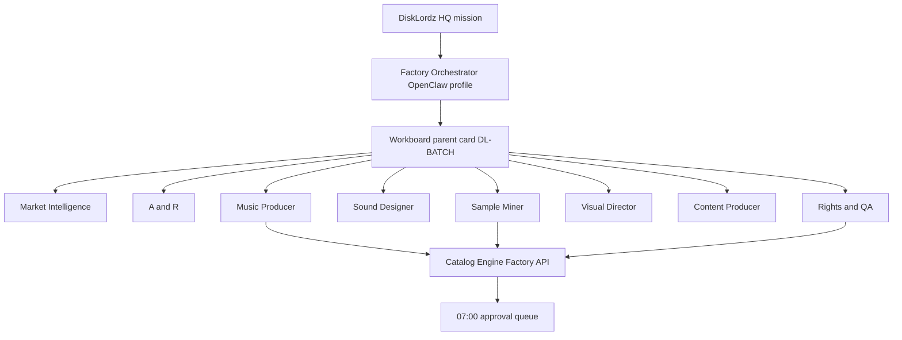

# Autonomous vintage sample synthesis — four-artist collective (OpenClaw 2.0)

This document adapts the original **1970s–1980s Soul, Jazz, and R&B collective** orchestration vision for **Southern phonk and screwed production** into DiskLordz’s **four locked artist lanes**, **YouTube brands**, and **Factory + OpenClaw Workboard** runtime.

**Original thesis (preserved):** Treat the catalog as a **fictional vintage crate-digging collective** — not random AI tracks. Agents plan **batches** that *behave* like soul/jazz/R&B source material was found, chopped, pitched, and recontextualized for modern phonk, screw, French touch, and cyber funk — with **humanization** (MPC / SP-808 / tape) as the fingerprint layer.

**Policy:** Same as [FACTORY_RESEARCH.md](FACTORY_RESEARCH.md) — Market Intel and A&R do not assign lanes or post Slack greenlights without sourced `DL-OPP-*` records.

## Four artists ↔ four channels

| Artist | YouTube brand | Vintage source era (HQ) | Modern destination | BPM |
|--------|---------------|-------------------------|--------------------|-----|
| **DL001** | Boulevard 86 | Late-70s / 80s **disco-funk**, boogie, filter-house sample vocabulary | French touch / electro-funk (talkbox, 909) | 118–124 |
| **DL002** | Midnight Circuit | **Memphis soul**, 80s R&B stabs, jazz-funk horns (chopped tight) | Drift phonk · wave phonk | 140–160 |
| **DL006** | Disklordz | **Houston slow soul**, 70s jazz keys, 80s quiet storm loops | DJ Screw · 90s phonk · lo-fi tape | 60–95 |
| **DL004** | Terminal Mirage | **80s digital funk**, fusion bass, DX/FM timbres, smooth R&B pads | Cyber funk + vapor aesthetic (coding) | 112–128 |

**Shared crate (collective rules):**

- **Era band:** 1970–1989 primary; occasional 90s **digital** soul only where the artist brief allows (DL004).
- **Harmony:** minor pentatonic, Dorian, soul turnarounds; jazz **ii–V** fragments as one-shots, not academic solos.
- **Rhythm:** live drum feel → sampled break *ghosts*; swung hi-hats for DL006; grid-tight for DL002.
- **Vocal policy:** wordless soul oohs, short Memphis-style phrases (rights-cleared or synthetic); no impersonation of named legacy artists.
- **Provenance:** Rights & QA tags every asset `synthetic` | `licensed` | `public_domain` | `original_composition` — no publish without status.

Machine-readable roster: [`disklordz-factory/database/artist_collective_seed.json`](../disklordz-factory/database/artist_collective_seed.json).

## Architecture: Factory loop inside OpenClaw Workboard

DiskLordz **Factory** defines *what* to build (schemas, agents, catalog, night shift). **OpenClaw 2.0 Workboard** defines *how* autonomous runs decompose and dispatch work on your Gateway.

**OpenClaw file identities (SOUL.md / AGENTS.md):** [`docs/OPENCLAW_VINTAGE_COLLECTIVE.md`](OPENCLAW_VINTAGE_COLLECTIVE.md) and [`disklordz-factory/openclaw/`](../disklordz-factory/openclaw/) — install with `./disklordz-factory/scripts/install-openclaw-workspace.sh`.



### Parent card (one per batch)

Create one Workboard card per manufacturing run:

- **Title:** `Vintage collective batch — {mission slug}`
- **Skills:** `disklordz-factory`, `vintage-sample-synthesis`
- **Metadata:** `batch_mission`, `target_count`, `artist_ids[]`, `youtube_brand_ids[]`
- **Board flags:** `autoDecompose: true`, `orchestratorProfile: DISKLORDZ_FACTORY_ORCHESTRATOR`

Orchestrator uses `workboard_decompose` (or manual `workboard_create` + `workboard_link`) to spawn **child cards** per stage and per artist lane.

### Child card template (×4 artists)

For each greenlit `artist_id`, decompose into dependent children (order matters):

| Order | Card | Assignee agent | Output asset kinds |
|-------|------|----------------|-------------------|
| 1 | `DISCOVER — {artist} — source gap` | Market Intelligence | `DL-OPP-*` link |
| 2 | `IDEATE — {artist} — batch concept` | A&R + Creative Director | concept manifest |
| 3 | `GENERATE — {artist} — vintage brief` | Music Producer | `DL-BRF-*` brief JSON |
| 4 | `GENERATE — {artist} — sound families` | Sound Designer | `DL-DRM-*`, `DL-OSC-*` |
| 5 | `PRODUCE — {artist} — humanize lane` | Operator + Producer | `DL-TRK-*`, stems |
| 6 | `PACKAGE — {artist} — crate split` | Sample Miner | `DL-KIT-*`, MIDI, one-shots |
| 7 | `PACKAGE — {artist} — visual` | Visual Director | `DL-VIS-*` |
| 8 | `PUBLISH — {artist} — {brand}` | Content + Copy | metadata cluster |
| 9 | `QA — {artist} — rights gate` | Rights & QA | PASS → approval queue |

**Dispatch:** `openclaw workboard dispatch` (Gateway) or Factory API `POST /night-shift/run` for in-repo simulation.

Card JSON template: [`disklordz-factory/workflows/openclaw_vintage_collective_cards.json`](../disklordz-factory/workflows/openclaw_vintage_collective_cards.json).

## Per-artist vintage synthesis rules

### DL001 — Boulevard 86 (Paris robot funk)

- **Dig:** 1977–1983 disco-funk basslines, string stabs, filtered loops (sample *behavior*, not specific records).
- **Transform:** 4-on-the-floor 909, sidechain pump, talkbox/vocoder hooks, **118–124 BPM**.
- **Products:** `boulevard-*` kits — filtered chord MIDI, vocoder phrase map, 909/707 packs.
- **Do not:** Memphis cowbell phonk tropes; screw tempo.

### DL002 — Midnight Circuit (fast phonk)

- **Dig:** Memphis soul chops, 80s R&B minor-key stabs, short horn hits.
- **Transform:** pitch-stretched chops, 808 glide, cowbell/wave leads, **140–160 BPM**.
- **Products:** `midnight-*` — chop kits, 808 banks, wave stab MIDI.
- **Do not:** screw/slow-pitch whole batches; that is DL006.

### DL006 — Disklordz (screw / 90s phonk)

- **Dig:** Slow soul loops, jazz Rhodes, 70s–80s ballad harmony for **pitch-down** treatment.
- **Transform:** DJ Screw style slowdown, tape wow, unquantized drums, **60–95 BPM**.
- **Products:** `disklordz-*` — screw-ready loops, pitched vocal stems, SP-404 chains.
- **Labs tie-in:** SP-1200 bit-crunch demos for authenticity marketing.
- **Do not:** gym/drift tempo or wave-phonk lead stacks.

### DL004 — Terminal Mirage (cyber funk)

- **Dig:** 80s digital funk, fusion bass, FM bells, smooth R&B pad voicings.
- **Transform:** rubbery digital bass, tight cyber drums, minimal vox, **112–128 BPM**; vapor **visual** layer on Shorts/thumbs.
- **Sub-series:** optional **Slow Grid** 85–100 BPM sub-playlist (labeled separately).
- **Products:** `terminal-mirage-*` MIDI, stab presets, vapor texture packs.

## Sample Miner — “crate split” standard

From each approved **parent track** (`DL-TRK-*`), Sample Miner extracts:

1. **Hook loop** (8 bars) — hero sample behavior  
2. **Drum ghost** — break-derived one-shots  
3. **Harmony stems** — keys/strings/Rhodes MIDI map  
4. **Bass family** — DI + saturated variant  
5. **FX bed** — tape/noise layer for DL006 only when brief says screw  

Prefix kits by brand (`boulevard-`, `midnight-`, `disklordz-`, `terminal-mirage-`).

## Night shift mission (default)

Use this mission string for OpenClaw + Factory API:

```text
Vintage collective batch — 1970s–1980s soul/jazz/R&B synthesis for four lanes (DL001 Boulevard 86, DL002 Midnight Circuit, DL006 Disklordz screw/phonk, DL004 Terminal Mirage); phonk and screwed derivatives research-gated
```

```bash
curl -s -X POST http://127.0.0.1:8787/night-shift/run \
  -H 'Content-Type: application/json' \
  -d '{"target_count":25,"artist_ids":["DL001","DL002","DL006","DL004"]}'
```

`artist_ids` only apply when HQ overrides; otherwise night shift uses **A&R greenlit** artists from research store.

After ingesting four brand opportunities:

```bash
./disklordz-factory/scripts/ingest-youtube-network-research.sh
curl -s -X POST 'http://127.0.0.1:8787/night-shift/run?notify_slack=false' \
  -H 'Content-Type: application/json' \
  -d '{"target_count":25}'
```

## API

- `GET /collective/artists` — roster + vintage rules + YouTube brand linkage (from seed JSON).

## Related

- [DISKLORDZ_YOUTUBE_NETWORK.md](DISKLORDZ_YOUTUBE_NETWORK.md)  
- [disklordz-factory/ARCHITECTURE.md](../disklordz-factory/ARCHITECTURE.md)  
- [OpenClaw Workboard](https://docs.openclaw.ai/plugins/workboard)  
- [FACTORY_RESEARCH.md](FACTORY_RESEARCH.md)
