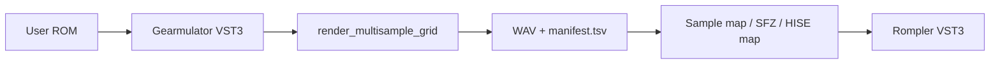

# From Gearmulator material → a shippable synthesizer

**Short answer:** Yes — but **how** depends on whether you want a **rompler** (samples), a **native DSP synth** (like JD Upgraded), or a **separate GPLv3 emulator product**. Gearmulator **firmware and source** are not a drop-in library for proprietary JUCE code without a license plan.

You already have **one synthesizer** in this repo: **JD Upgraded** (Track C) — four-tone PCM, clean-room ROM, JD-style UX ([docs/ARCHITECTURE.md](ARCHITECTURE.md)). Gearmulator (Track E) is **reference + capture**, not the ship engine.

## Decision matrix

| Goal | Realistic path | Ship stack | Gearmulator role |
|------|----------------|------------|------------------|
| **Rompler / “hardware in a box” from captured WAVs** | Multisample → map → HISE or JUCE sampler | Track **D** (HISE) or new JUCE SKU | **Render** presets via VST3 (`render_multisample_grid.sh` / Docker) |
| **New VA-style synth (original code)** | Study SysEx/MIDI + UX; reimplement DSP | Track **C** JUCE factory | **Reference** only (JE-8086, Virus, etc.) |
| **Ship the actual LLE plugin** | Build & distribute your fork’s VST3/CLAP | **Separate product** (GPLv3) | **Full upstream** on your fork |
| **Extend JD Upgraded sound** | More clean-room waves / zones | `Source/` + `GenerateCleanroomRom` | **Do not** import firmware PCM into `jdupg_cleanroom.rom` |

## Path 1 — Sample-based synthesizer (recommended for multisample WAVs)

**Input:** WAV grids under `gearmulator-lane/multisamples/out/` + `manifest.tsv` ([GEARMULATOR_MULTISAMPLING.md](GEARMULATOR_MULTISAMPLING.md)).

**Pipeline:**

1. Capture **one preset at a time** (fixed program index, note/velocity grid, long tail).
2. Normalize/trim (optional offline tool — not in repo yet).
3. Build **multisample map** (root note per file from manifest `note` column).
4. **Track D:** Import into **HISE** under [hise-sketch/](../hise-sketch/) — fastest path to a selling rompler ([HISE_SKETCH_LANE.md](HISE_SKETCH_LANE.md)).
5. **Track C (later):** Port to JUCE `Sampler` / custom rompler in a **new** CMake target after Planner + Marketing approve a `product_id`.

**Legal:** Captured audio may be derivative of firmware/ROM you licensed for personal use. **Retail** requires clear rights and marketing review; do not commit WAVs or ROMs to git.

## Path 2 — Native synthesizer (no sample dependency)

Use Gearmulator to **validate behavior** (filter response, envelope shape, SysEx quirks), then implement in **original C++**:

- **JD lineage:** extend JD Upgraded tones, TVF, coupling — already the model ([ROM.md](ROM.md)).
- **JP-8000 lineage:** different architecture (supersaw / OSC modeling) — would be a **new** JUCE product, not a fork of `jeLib` into `Source/`.

**Do not** copy GPLv3 `gearmulator-lane/gearmulator/source/**` into `Source/` without a **license WO** and compliance review.

## Path 3 — Ship Gearmulator itself (or your fork)

Your fork can **be** the product: Osirus, JE-8086, etc. as VST3/CLAP built from upstream CMake.

- **License:** GPLv3 — source offer, plugin dependencies, and combined works rules apply.
- **ROM:** still user-supplied; installer policy mirrors upstream.
- **Monorepo:** keep submodule/fork **outside** JD Upgraded binary; optional separate repo for store listing.

## Path 4 — Hybrid “player + procedural layers”

Disklordz-style products sometimes stack **sample core + synthetic layers** (see [Wave909/ARCHITECTURE.md](../Wave909/ARCHITECTURE.md) for wavetable-native example):

- Bottom: multisample rompler (Path 1).
- Top: clean-room wavetable or noise (no Gearmulator PCM in repo).

Requires explicit product spec and Airtable row before Cursor factory WIP.

## What to capture for synth design (even if not shipping samples)

| Material | Use in native synth |
|----------|---------------------|
| SysEx / program dumps | JD import rules [SYSEX.md](SYSEX.md); JP reference in fork only |
| A/B audio from LLE vs JD | Tuning envelopes, filter gain staging |
| `manifest.tsv` grids | Ground truth for rompler key ranges |
| UI / parameter names | UX spec only — reimplement controls |

## Gates before a customer-facing SKU

1. **Business Planner + Marketing** — `product_id`, family, price ([DISKLORDZ_PLUGIN_TRACKS.md](DISKLORDZ_PLUGIN_TRACKS.md)).
2. **Installer policy** — no Roland/third-party ROM in retail ([INSTALLER_POLICY.md](INSTALLER_POLICY.md)).
3. **Track choice** — HISE sketch vs JUCE factory vs GPLv3 sidecar.
4. **Open a WO** — e.g. `[Plugin][HISE]` for rompler, or JUCE factory WO for new target.

## Suggested next step (rompler from your multisample plan)

1. Fork Gearmulator ([GEARMULATOR_FORK.md](GEARMULATOR_FORK.md)).
2. Render one factory preset grid (Docker or VM).
3. Open Antigravity handoff: HISE sample map + macro page from `manifest.tsv`.
4. When validated, promote from sketch lane to store SKU or JUCE port WO.

## Related

- [GEARMULATOR_LANE.md](GEARMULATOR_LANE.md) · [GEARMULATOR_MULTISAMPLING.md](GEARMULATOR_MULTISAMPLING.md) · [GEARMULATOR_FORK.md](GEARMULATOR_FORK.md)
- [docs/ARCHITECTURE.md](ARCHITECTURE.md) (JD Upgraded) · [hise-sketch/ARCHITECTURE.md](../hise-sketch/ARCHITECTURE.md)
