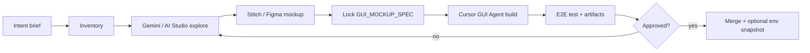

# GUI design SOP — Instruments monorepo

Standard operating procedure for **designing, documenting, and shipping** product GUIs. Works with **Gemini**, **Google Stitch**, **Google AI Studio**, and **Cursor (GUI Agent)**.

**Companion:** [GUI_AGENT_PLAYBOOK.md](GUI_AGENT_PLAYBOOK.md) · Product example: [disklordz/lofi12-phonk-factory/docs/GUI_MOCKUP_SPEC.md](../disklordz/lofi12-phonk-factory/docs/GUI_MOCKUP_SPEC.md)

---

## 1. Roles

| Role | Who | Output |
|------|-----|--------|
| **Product / you** | Decisions, approve mockups | Signed-off frames + behavior notes |
| **Design tools** | Gemini, Stitch, AI Studio | Explorations, mockups, copy |
| **GUI Agent** | Cursor Cloud or IDE Agent | Spec update, HTML/CSS/JS (or React), tests, walkthrough video |
| **Reviewer** | Human or second agent pass | Accessibility, scope, security |

---

## 2. Pipeline (end-to-end)



### Phase 0 — Intent (15 min human)

- **One sentence goal** (who uses it, on what device).
- **Success state** (what proof looks like: video, screenshot set).
- **Out of scope** (explicit).
- **Stack** (static HTML, Next.js, JUCE UI, Streamlit, etc.) — read product `ARCHITECTURE.md`.

### Phase 1 — Visual inventory (GUI Agent or human)

Before pixels, list every **control, state, and panel** (see §4 template). For Lofi-12 phonk factory, start from the [visual inventory in chat / GUI_MOCKUP_SPEC](../disklordz/lofi12-phonk-factory/docs/GUI_MOCKUP_SPEC.md).

Deliverable: **`docs/GUI_MOCKUP_SPEC.md`** (or `product/docs/GUI_MOCKUP_SPEC.md`) with:

- Wireframe ASCII or linked frames  
- Control → API/behavior table  
- Hardware constraints (e.g. 4 vs 6 tracks)  
- Open questions for mockup (global vs per-track FX, auto-replace backing, etc.)

### Phase 2 — Explore with Gemini / Google AI Studio

Use when layout and **information architecture** are still fuzzy.

**Google AI Studio**

- Fast **multimodal** prompts: “Critique this wireframe”, “Suggest 3 layouts for a 6-track sequencer”.
- Prototype **copy** (labels, hints, error strings) in a structured JSON or markdown table.
- Export prompts that you reuse in Stitch.

**Gemini (app or API)**

- **Competitive / reference gathering** (describe patterns, not clone copyrighted UIs).
- **Accessibility pass** on pasted HTML or screenshot descriptions.
- **State matrix**: for each screen, list empty / loading / error / success visuals.

**Rules**

- Do not paste **secrets**, `.env`, or customer data into public tools.
- Treat model output as **untrusted** until reviewed (same as [security baseline](../.cursor/rules/security-baseline.mdc)).
- Save useful prompts in `docs/gui/prompt-library/` (optional) or in the product spec appendix.

### Phase 3 — Visual mock with Google Stitch (or Figma)

**Reference implementation:** Lofi-12 phonk factory Stitch v1 — [references/gui/v1-stitch/](../disklordz/lofi12-phonk-factory/references/gui/v1-stitch/) + [GUI_MOCKUP_SPEC.md](../disklordz/lofi12-phonk-factory/docs/GUI_MOCKUP_SPEC.md).

**Stitch** (Google): prompt- or sketch-driven **UI mocks** — use for:

- Tab order, density, color mood (Memphis / phonk / dark studio).
- **Multiple frames** (default tab, expanded overview, generate flow, FX panel).
- Export **PNG** or share link for the repo.

**Figma** (if you prefer): same frames; use Fig query plugins only when already in your workflow.

Deliverables (commit or attach to PR):

- `references/gui/<product>-mockup-v1.png` (or `frames/` folder)  
- Short **changelog** in `references/gui/README.md` (date, tool, what changed)

### Phase 4 — Spec lock

GUI Agent (or human) updates **`GUI_MOCKUP_SPEC.md`**:

- Frame names ↔ file paths  
- **Stable control IDs** where possible (match `id=` in HTML for 1:1 agent wiring)  
- API contract frozen (paths, JSON shapes) — backend can ship before pixel-perfect CSS  

**Gate:** Product owner marks spec **LOCKED** in the doc header (`Status: LOCKED v1`).

### Phase 5 — Implement (Cursor GUI Agent)

See [GUI_AGENT_PLAYBOOK.md](GUI_AGENT_PLAYBOOK.md). Minimum:

- Match spec sections and behaviors  
- Manual E2E + **screen recording** for non-trivial UI  
- Unit/API tests for anything behind buttons  

### Phase 6 — Review checklist

- [ ] All spec controls exist and match labels (or documented rename)  
- [ ] Keyboard / focus path sane (sequencer, forms)  
- [ ] Loading and error states visible (status bar at minimum)  
- [ ] No secrets in client bundle  
- [ ] Artifacts in PR (video + screenshots)  
- [ ] `ARCHITECTURE.md` updated if new routes or APIs  

---

## 3. Tool selection guide

| Need | Prefer |
|------|--------|
| Quick layout alternatives, copy tables | **Google AI Studio** / **Gemini** |
| Styled multi-screen mock | **Google Stitch** |
| High-fidelity design system, handoff | **Figma** |
| Wireframe + API contract in-repo | **`GUI_MOCKUP_SPEC.md`** |
| Working UI + tests | **Cursor GUI Agent** |
| Prove it works in browser | **GUI Agent + computer use / recording** |

You do **not** need every tool every time. Minimum path: **Phase 0 → Phase 1 → Phase 5** (spec + agent) when the UI is a small increment on an existing screen.

---

## 4. Visual inventory template (copy per product)

```markdown
# <Product> — GUI inventory

Status: DRAFT | LOCKED vN
Stack: e.g. static HTML + Python serve.py
Max width / target: e.g. 1100px desktop-first

## Sections (top → bottom)
1. Header — title, subtitle
2. …

## Controls
| ID / name | Type | Default | Behavior | API / notes |
|-----------|------|---------|----------|-------------|

## Visual states
| State | User-visible cue |
|-------|------------------|

## Frames for mockup
1. …

## Open questions
- …
```

---

## 5. Product-specific paths (this repo)

| Product | Spec | Implementation | Mockups |
|---------|------|----------------|---------|
| Lofi-12 phonk factory + sequencer | [GUI_MOCKUP_SPEC.md](../disklordz/lofi12-phonk-factory/docs/GUI_MOCKUP_SPEC.md) | [sequencer/static/](../disklordz/lofi12-phonk-factory/sequencer/static/) | [references/gui/](../disklordz/lofi12-phonk-factory/references/gui/) |
| Disklordz SaaS | TBD — create `disklordz/website/docs/GUI_MOCKUP_SPEC.md` when redesigning | [disklordz/website/](../disklordz/website/) | same pattern |
| VST testing ops | Streamlit — lighter spec OK | [vst-testing-ops/app.py](../vst-testing-ops/app.py) | optional |

---

## 6. Versioning mockups vs code

- **Spec version** (`LOCKED v2`) increments when behavior or API changes.  
- **Mockup filename** includes version: `phonk-sequencer-v2.png`.  
- **CSS/visual-only** tweaks can ship without spec version bump if behavior unchanged (note in PR).

---

## 7. Related standards

- [CURSOR_AGENT_PLAYBOOK.md](CURSOR_AGENT_PLAYBOOK.md) — structured prompts, artifacts  
- [AGENTIC_PROJECT_STANDARDS.md](AGENTIC_PROJECT_STANDARDS.md) — required repo files  
- [.cursor/rules/gui-design.mdc](../.cursor/rules/gui-design.mdc) — agent rule when editing UI paths  
