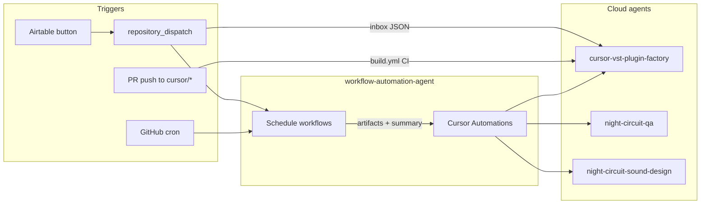

# VST Plugin Factory — automation schedule

**Owner:** **workflow-automation-agent** (GitHub cron, `repository_dispatch`, Cursor Automations, optional `subscribe_timer`).  
**Implementers:** **cursor-vst-plugin-factory**, **night-circuit-qa**, **night-circuit-sound-design** (see [AGENT_TEAM_ROSTER.md](AGENT_TEAM_ROSTER.md)).

All cron times **UTC**. Map to local time in Cursor Automations UI; keep GitHub `schedule` in UTC.

## Architecture (who fires what)



**Rule:** GitHub Actions prove **build/automation** on Linux. **FL Studio / MPC Software** sign-off stays **human or dedicated host runs** — never inferred from Cursor VM green.

---

## Weekly calendar (UTC)

| When | Trigger | Workflow / automation | Primary agent | Action |
|------|---------|------------------------|---------------|--------|
| **Mon 09:00** | Cron | [vst-plugin-factory-schedule.yml](../.github/workflows/vst-plugin-factory-schedule.yml) `plugin-ci-health` | workflow-automation-agent | Monorepo plugin CI (`run_business.py --profile ci`); upload log artifact |
| **Mon 09:30** | Cursor Automation | `vst-factory-monday-health-triage` | cursor-vst-plugin-factory | Triage artifact; if FAIL → draft `[Plugin][JUCE][HEALTH]` WO for pm-agent; if PASS → one-line green |
| **Mon 10:00** | Cursor Automation | `night-circuit-qa-gate1` | night-circuit-qa | Run Gate 1 checklist ([BUILD_BASELINE.md](../ProphetRev2Trap/docs/BUILD_BASELINE.md)); update `ProphetRev2Trap/qa/reports/` |
| **Tue–Thu** | Event | Inbox + PR CI | cursor-vst-plugin-factory | Execute `[Plugin][JUCE]` WOs from [inbox](../disklordz/vst-factory/inbox/); max **2** WIP |
| **Wed 10:00** | Cron | `night-circuit-integrity` job (same workflow file) | workflow-automation-agent | Build `ProphetRev2Trap_VST3`, `NightCircuitTests`, `verify_preset_bank.py`, pluginval artifact |
| **Wed 10:30** | Cursor Automation (optional) | `night-circuit-qa-bank` | night-circuit-qa | Only if Wed job FAIL or on main drift; fix or file WO — **no** musical claims |
| **Daily 11:00** | Cron | [nightly-qa.yml](../.github/workflows/nightly-qa.yml) | workflow-automation-agent | Full monorepo QA (`--profile full`) |
| **Thu 16:00** | Cursor Automation (biweekly) | `night-circuit-sound-design-batch` | night-circuit-sound-design | 1 category listening report template OR featured-list PR (no host = doc-only planning) |
| **Fri 17:00** | Cron | `doc-sync` job | workflow-automation-agent | ARCHITECTURE / CMake checklist artifact |
| **Fri 17:30** | Cursor Automation | `vst-factory-friday-doc-sync` | cursor-vst-plugin-factory | If checklist non-empty → docs-only draft PR |
| **Fri 18:00** | Cursor Automation (optional) | `night-circuit-sound-design-gui` | night-circuit-sound-design | One GUI spec increment vs [NIGHT_CIRCUIT_GUI_SPEC.md](../ProphetRev2Trap/design/NIGHT_CIRCUIT_GUI_SPEC.md) |

**Biweekly:** Sound-design **Thu** automation runs on **odd ISO weeks** only (configure skip in Cursor UI or prompt).

---

## Event-driven (always on)

| Event | Automation | Actor | Result |
|-------|------------|-------|--------|
| Airtable WO, `owner_agent = cursor-vst-plugin-factory` | [airtable-vst-factory-handoff.yml](../.github/workflows/airtable-vst-factory-handoff.yml) | workflow-automation-agent | `disklordz/vst-factory/inbox/HO-*.json` committed |
| Push to `cursor/*` touching `Source/`, `ProphetRev2Trap/`, `Wave909/` | `build.yml` / PR CI | GitHub | Required `cmake` check |
| Merge to `main` | nightly-qa + PR history | GitHub | Regression signal |
| Manual | `workflow_dispatch` on schedule workflow | Human / pm-agent | Re-run `plugin-ci-health`, `doc-sync`, or `night-circuit-integrity` |
| Plugin PR opened | `subscribe_github_ci` (Cursor) | Active Cloud Agent | Wait for CI before claiming done |

### PM routing (work order prefixes)

| Title prefix | `owner_agent` | Inbox / prompt |
|--------------|---------------|----------------|
| `[Plugin][JUCE]` | cursor-vst-plugin-factory | `disklordz/vst-factory/inbox/` |
| `[Plugin][JUCE][QA]` | night-circuit-qa | WO body links branch; prompt: [NIGHT_CIRCUIT_QA_SUBAGENT.md](NIGHT_CIRCUIT_QA_SUBAGENT.md) |
| `[Plugin][JUCE][Design]` | night-circuit-sound-design | Prompt: [NIGHT_CIRCUIT_SOUND_DESIGN_SUBAGENT.md](NIGHT_CIRCUIT_SOUND_DESIGN_SUBAGENT.md) |
| `[Plugin][HISE]` | antigravity-hise | Antigravity inbox (out of factory schedule) |

QA and Design WOs **do not** count toward the **2× JUCE WIP** cap unless pm-agent explicitly tags them as factory-overlap.

---

## GitHub Actions jobs (workflow-automation-agent)

File: [`.github/workflows/vst-plugin-factory-schedule.yml`](../.github/workflows/vst-plugin-factory-schedule.yml)

| Job | Cron (UTC) | `workflow_dispatch` choice | Output artifact |
|-----|------------|------------------------------|-----------------|
| `plugin-ci-health` | `0 9 * * 1` | `plugin-ci-health` | `vst-factory-health-<run_id>` |
| `night-circuit-integrity` | `0 10 * * 3` | `night-circuit-integrity` | `night-circuit-integrity-<run_id>` |
| `doc-sync` | `0 17 * * 5` | `doc-sync` | `vst-factory-doc-sync-<run_id>` |

Related (not in this workflow): **Daily 11:00** [nightly-qa.yml](../.github/workflows/nightly-qa.yml).

---

## Cursor Automation prompt catalog

Create in Cursor dashboard (repo **Instruments**, default branch **main** unless WO specifies). Name automations to match the table below.

### 1. `vst-factory-monday-health-triage` — Mon 09:30 UTC

```markdown
You are cursor-vst-plugin-factory on scheduled health triage.

1. Fetch the latest successful or failed run of workflow "VST Plugin Factory schedule", job "plugin-ci-health" (artifact vst-factory-health-*).
2. If missing, run locally: python3 vst-testing-ops/run_business.py --profile ci
3. If FAIL: summarize vst-testing-ops/error_log.txt; do NOT fix without a WO. Output a pm-agent stub: WO-YYYY-JUCE-HEALTH-NNN title "[Plugin][JUCE][HEALTH] …".
4. If PASS: reply "Plugin factory health green" only.
```

### 2. `night-circuit-qa-gate1` — Mon 10:00 UTC

```markdown
You are Night Circuit QA (docs/NIGHT_CIRCUIT_QA_SUBAGENT.md). Gate 1 only.

Run ProphetRev2Trap/docs/BUILD_BASELINE.md commands through pluginval.
Write ProphetRev2Trap/qa/reports/<date>-bank-integrity.md with PASS/FAIL/NOT TESTED.
Do NOT claim FL Studio or MPC Software testing unless you ran them on a real host OS.
```

### 3. `night-circuit-qa-bank` — Wed 10:30 UTC (on failure or manual)

```markdown
You are Night Circuit QA. Download artifact night-circuit-integrity-* from the latest schedule workflow run.
If PASS: no PR. If FAIL: minimal fix on cursor/* branch OR file WO for cursor-vst-plugin-factory with reproduction from log.
```

### 4. `vst-factory-friday-doc-sync` — Fri 17:30 UTC

```markdown
You are cursor-vst-plugin-factory. Download doc-sync-checklist artifact from "VST Plugin Factory schedule" doc-sync job.
If only the default green checkbox: stop. Else open draft PR (docs only): ARCHITECTURE.md, product ARCHITECTURE.md, ProphetRev2Trap/design/ if GUI spec drift.
```

### 5. `night-circuit-sound-design-batch` — Thu 16:00 UTC (biweekly)

```markdown
You are Night Circuit Sound Design (docs/NIGHT_CIRCUIT_SOUND_DESIGN_SUBAGENT.md).

Without a real FL/MPC session, you may: update FeaturedPresets.cpp rationale in design/reports/, or draft one GUI increment spec.
With a host session: fill ProphetRev2Trap/design/reports/ from LISTENING_REPORT_TEMPLATE.md and HOST_COMPATIBILITY.md rows.
Never claim DAW testing from Linux VM alone.
```

### 6. Inbox consumer — event (push to inbox or manual)

```markdown
Read newest open HO-*.json in disklordz/vst-factory/inbox/. Execute per docs/VST_PLUGIN_FACTORY_AGENT.md.
Branch: handoff work_order.branch. PR title must include WO id.
```

---

## Subscription timers (in-conversation)

For an **active** Cloud Agent on a plugin WO, workflow-automation-agent may register:

| Timer | Cron | Use when |
|-------|------|----------|
| `subscribe_github_ci` | — | PR open; preferred over blind polling |
| `vst-factory-weekly-health` | `0 9 * * 1` | Long-lived factory thread reminder |
| `night-circuit-qa-reminder` | `0 10 * * 1` | Long-lived Night Circuit PR; run Gate 1 |

Use Cursor **subscribe** MCP (`cursor-subscriptions`) when dashboard cron is unavailable.

---

## Capacity & escalation

| Policy | Value |
|--------|--------|
| Max concurrent `[Plugin][JUCE]` Cursor WOs | **2** (Factory Manager) |
| Scheduled health / integrity / doc jobs | Do **not** count as WOs |
| CI red on **main** | pm-agent opens `[Plugin][JUCE][HEALTH]` within 1 business day |
| Night Circuit bank integrity red | QA files WO to factory; sound-design does **not** block on 1028 count |
| Host matrix (FL / MPC) | **Human** or explicit host WO; quarterly refresh of version columns |

---

## Secrets & wiring

| Secret | Use |
|--------|-----|
| `AIRTABLE_API_KEY`, `AIRTABLE_BASE_ID` | Handoff script |
| `SLACK_WEBHOOK_URL` | Optional: post Mon health + Wed Night Circuit summary |
| Cursor Cloud API / Automations | Dashboard only — not in git |

Setup: [disklordz/automation/VST_PLUGIN_FACTORY.md](../disklordz/automation/VST_PLUGIN_FACTORY.md).

---

## Related

- [VST_PLUGIN_FACTORY_AGENT.md](VST_PLUGIN_FACTORY_AGENT.md) — factory persona
- [NIGHT_CIRCUIT_QA_SUBAGENT.md](NIGHT_CIRCUIT_QA_SUBAGENT.md) · [NIGHT_CIRCUIT_SOUND_DESIGN_SUBAGENT.md](NIGHT_CIRCUIT_SOUND_DESIGN_SUBAGENT.md)
- [ProphetRev2Trap/docs/HOST_COMPATIBILITY.md](../ProphetRev2Trap/docs/HOST_COMPATIBILITY.md) — DAW matrix (not VM)
