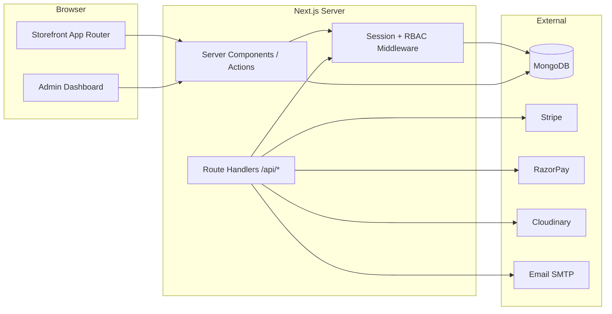

# eCommerce Platform — Architecture

## Purpose

Full-stack **Next.js 15** eCommerce system (storefront + admin dashboard) aligned with the 2025 course blueprint: MongoDB via Prisma, custom auth with RBAC, Stripe/RazorPay, Cloudinary uploads, React Hook Form + Zod, and **Cursor AI–driven** step-by-step SOPs.

**Audience:** Developers and AI agents building or extending the shop; operators using the admin dashboard.

## Build & run

| Component | Command | Binary / URL |
|-----------|---------|--------------|
| Storefront + Admin (dev) | `cd web && cp .env.example .env.local && npm run dev` | http://localhost:3000 |
| Production build | `cd web && npm run build && npm start` | — |
| Prisma client | `cd web && npx prisma generate` | — |
| DB push (MongoDB) | `cd web && npx prisma db push` | requires `DATABASE_URL` |

## Data flow

1. **Catalog:** Admin CRUD → Prisma → MongoDB; storefront reads via Server Components and cached queries.
2. **Cart / checkout:** Client state + server actions; order persisted on payment intent success.
3. **Payments:** Checkout creates Stripe/RazorPay session; webhooks update `Order.status`.
4. **Media:** Admin uploads → Cloudinary signed upload → URL stored on `Product` / `Banner`.
5. **Analytics:** Aggregations on `Order` / `OrderItem` for admin dashboard charts.

## Threading / realtime

Not a realtime audio product. Use **Next.js streaming** for RSC. Avoid long blocking work in middleware; run webhooks and email in route handlers with idempotency keys.

## Key modules

| Path | Responsibility |
|------|----------------|
| `docs/BLUEPRINT.md` | Phase checklist (course-aligned) |
| `docs/WALKTHROUGH.md` | Human + agent walkthrough |
| `docs/SOP/` | Standard operating procedures per phase |
| `.cursor/skills/ecommerce-builder/` | Specialized Cursor agent skill |
| `templates/` | Copy-paste scaffolds (admin CRUD, API, Zod, email) |
| `web/src/app/(store)/` | Customer-facing routes |
| `web/src/app/(admin)/admin/` | Dashboard routes |
| `web/src/app/api/` | REST/webhooks |
| `web/prisma/schema.prisma` | Domain models |
| `web/src/lib/` | Auth, db, payments, cloudinary, validators |

## Extension points

- **New admin entity:** Copy `templates/admin/crud-page/` → wire Prisma model → add SOP-04 checklist.
- **New payment provider:** Extend `templates/api/payment-webhook.route.ts` and `web/src/lib/payments/`.
- **New storefront section:** Use `templates/storefront/page-section.template.tsx`.
- **Mobile app (future):** Reuse `/api/*` contracts documented in `docs/BLUEPRINT.md` Phase 12.

## Related docs

- [README.md](README.md) — quick start
- [docs/BLUEPRINT.md](docs/BLUEPRINT.md) — master plan
- [docs/SOP/README.md](docs/SOP/README.md) — SOP index
- [AGENTS.md](AGENTS.md) — agent operating rules
- Root repo index: [/ARCHITECTURE.md](../ARCHITECTURE.md)
